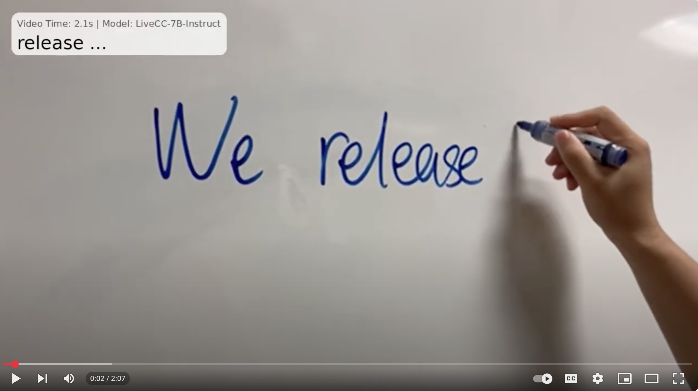

## LiveCC: Learning Video LLM with Streaming Speech Transcription at Scale

<a href="https://showlab.github.io/livecc/" target="_blank"></a>
<a href="https://huggingface.co/spaces/chenjoya/livecc" target="_blank"></a>
<a href="https://huggingface.co/papers/2504.16030" target="_blank"></a>
<a href="https://huggingface.co/chenjoya/LiveCC-7B-Instruct" target="_blank"></a>
<a href="https://huggingface.co/datasets/chenjoya/Live-WhisperX-526K" target="_blank"></a>
<a href="https://huggingface.co/datasets/stdKonjac/LiveSports-3K" target="_blank"></a>
<a href="https://huggingface.co/collections/chenjoya/livecc-67e29b3df1b6b5c6d5d682f4" target="_blank"></a>

[](https://www.youtube.com/watch?v=56sfodoHXo4)

*NOTE: Please follow the arxiv version <a href="https://huggingface.co/papers/2504.16030" target="_blank"></a> of our paper, rather than the CVPR camera ready version. We are sorry we submitted a wrong version and they do not allow to replace...*

### TLDR

The first video LLM capable of real-time commentary, trained with a novel video-ASR streaming method, SOTA on both streaming and offline benchmarks.

### Installation

Ensure you have Python version >= 3.11 installed.

#### One-Click Setup (Recommended)

```bash
git clone https://github.com/showlab/livecc.git
cd livecc
bash setup_env.sh
source .venv_livecc/bin/activate
```

This will automatically create a virtual environment, install PyTorch, flash-attn, and all dependencies from `requirements.txt`, and install `livecc-utils` from local source.

You can also customize the Python binary and venv directory:

```bash
bash setup_env.sh --python python3.11 --venv my_venv
```

#### Manual Setup

If you prefer to install manually:

```sh
pip install torch torchvision torchaudio
pip install -r requirements.txt
pip install flash-attn --no-build-isolation
pip install -e livecc-utils/
```

We trained our models under ```torch==2.6.0```, ```transformers==4.50.0```, ```liger-kernel==0.5.5```. But other versions should also work. 

#### Advanced

If you want to delve into our data production pipeline:

```sh
pip install insightface onnxruntime-gpu python_speech_features wavfile
```

### Quick Start

#### Gradio Demo
```
python demo/app.py --js_monitor
```
`--js_monitor` is to use javascript video timestamp monitoring (recommend to disable for environments with high latency)


#### CLI
```
python demo/cli.py
```


#### Hands-on Inference

Please refer to [inference.md](https://github.com/showlab/livecc/blob/main/inference.md)

### Training

The following scripts are for a single node training, with the batch size of 512. If you have multiple nodes, please try to set [torchrun arguments](https://pytorch.org/docs/stable/elastic/run.html) and ```--gradient_accumulation_steps``` accordingly.

#### Pre-training

##### Data

https://huggingface.co/datasets/chenjoya/Live-CC-5M

##### Scripts

[scripts/pt_local.sh](scripts/pt_local.sh)

The explanation for the training arugments:

```bash
export VIDEO_MIN_PIXELS=78400 # 100*28*28. the minimum visual frame tokens sent to llm is 100
export FPS_MAX_FRAMES=480 # maximum number of frames for each video (480/60/2 = 4min)
export VIDEO_MAX_PIXELS=19267584 # 24576*28*28. the maximum overall video tokens sent to llm is 24k (leave 8k for language)

learning_rate=2e-5 # pretraining uses 2e-5 lr
run_name="livecc_pretrain_24kx480x100_bs512lr$learning_rate"

WANDB_PROJECT='joya.chen' TOKENIZERS_PARALLELISM=false torchrun --standalone --nproc_per_node=8 train.py \
  --deepspeed ./scripts/deepspeed_zero2.json \                       # Use DeepSpeed ZeRO-2 config
  --output_dir checkpoints/$run_name \                               # Where to save model checkpoints
  --overwrite_output_dir True \                                      # Set False to resume from existing checkpoint
  --run_name $run_name \                                             # Unique identifier for the training run (used by WandB)
  --save_on_each_node True \                                         # Set False if nodes share a filesystem
  --do_train True \                                                  # Enable training mode
  --eval_strategy no \                                               # No evaluation between training steps
  --per_device_train_batch_size 1 \                                  # Batch size per GPU
  --gradient_accumulation_steps 64 \                                 # Effective batch size = 64 × num_gpus
  --learning_rate $learning_rate \                                   # Learning rate to use
  --warmup_ratio 0.03 \                                              # Warm-up proportion of training steps
  --optim adamw_torch \                                              # Optimizer: AdamW (PyTorch implementation)
  --lr_scheduler_type cosine \                                       # Cosine decay learning rate schedule
  --num_train_epochs 1 \                                             # Number of training epochs
  --logging_steps 10 \                                               # Log training metrics every 10 steps
  --save_steps 1000 \                                                # Save checkpoint every 1000 steps
  --bf16 True \                                                      # Use BF16 mixed precision (if supported)
  --tf32 True \                                                      # Use TF32 precision on NVIDIA Ampere+ GPUs
  --gradient_checkpointing True \                                    # Enable gradient checkpointing to save memory
  --pretrained_model_name_or_path Qwen/Qwen2-VL-7B \                 # Start from pretrained Qwen2-VL-7B model
  --annotation_paths datasets/live_cc_5m_with_seeks.jsonl \          # Dataset used for training
  --dataloader_num_workers 16 \                                      # Number of parallel workers for data loading
  --freeze_modules visual \                                          # Freeze visual encoder parameters
  --use_liger_kernel True \                                          # Use Liger kernel for faster attention (must match in inference)
  --report_to wandb                                                  # Enable logging to Weights & Biases
```

#### SFT

##### Data

https://huggingface.co/datasets/chenjoya/Live-WhisperX-526K

https://huggingface.co/datasets/lmms-lab/LLaVA-Video-178K

##### Scripts

[scripts/sft_local.sh](scripts/sft_local.sh)

```bash
export VIDEO_MIN_PIXELS=78400 # 100*28*28. the minimum visual frame tokens sent to llm is 100
export FPS_MAX_FRAMES=480 # maximum number of frames for each video (480/60/2 = 4min)
export VIDEO_MAX_PIXELS=19267584 # 24576*28*28. the maximum overall video tokens sent to llm is 24k (leave 8k for language)

learning_rate=1e-5 # sft uses 1e-5 lr
run_name="livecc_sft_24k480x100_live526k+llava178k+hound+onevision_lr$learning_rate"

WANDB_PROJECT='joya.chen' TOKENIZERS_PARALLELISM=false torchrun --standalone --nproc_per_node=8 train.py \
  --deepspeed ./scripts/deepspeed_zero2.json \                       # Use DeepSpeed ZeRO-2 config
  --output_dir checkpoints/$run_name \                               # Output checkpoint directory
  --overwrite_output_dir True \                                      # Set to False to resume training
  --run_name $run_name \                                             # Wandb and checkpoint run name
  --save_on_each_node True \                                         # Set False if using shared storage
  --do_train True \                                                  # Enable training mode
  --eval_strategy no \                                               # No evaluation during training
  --per_device_train_batch_size 1 \                                  # Batch size per GPU
  --gradient_accumulation_steps 64 \                                 # Accumulate gradients for effective batch size = 64 × num_gpus
  --learning_rate $learning_rate \                                   # Learning rate to use
  --warmup_ratio 0.03 \                                              # Learning rate warm-up ratio
  --optim adamw_torch \                                              # Optimizer type
  --lr_scheduler_type cosine \                                       # Cosine learning rate scheduler
  --num_train_epochs 1 \                                             # Total number of training epochs
  --logging_steps 10 \                                               # Log every 10 steps
  --save_steps 1000 \                                                # Save checkpoint every 1000 steps
  --bf16 True \                                                      # Use BF16 mixed precision
  --tf32 True \                                                      # Enable TF32 acceleration (NVIDIA Ampere+)
  --gradient_checkpointing True \                                    # Enable gradient checkpointing for memory efficiency
  --pretrained_model_name_or_path chenjoya/LiveCC-7B-Base \          # Initialization checkpoint
  --annotation_paths \                                               # Training datasets:
      datasets/live_whisperx_526k_with_seeks.jsonl \                 # - LiveCC 526k
      datasets/llava_ov_single_image_text_mix_with_seeks.jsonl \     # - OneVision (single image)
      datasets/llava_ov_multi_image_with_seeks.jsonl \               # - OneVision (multi-image)
      datasets/llava_hound_video_with_seeks.jsonl \                  # - LLaVA-Hound video
      datasets/llava_video_178k_with_seeks.jsonl \                   # - LLaVA-Video 178k
  --dataloader_num_workers 16 \                                      # Number of workers for data loading
  --freeze_modules visual \                                          # Do not update visual encoder
  --use_liger_kernel True \                                          # Use Liger kernel for efficient attention (enable at inference too)
  --report_to wandb                                                  # Report metrics to Weights & Biases
```

### Evaluation

#### LiveSports3KCC

The following scripts will automatically download data from [LiveSports3K](https://huggingface.co/datasets/stdKonjac/LiveSports-3K).

##### One-Click Evaluation

We provide `scripts/eval_livesports3kcc.sh` with three modes:

```bash
# 1. Generate LiveCC real-time commentary (default)
bash scripts/eval_livesports3kcc.sh

# For base model, add NOT_INSTRUCT=1
NOT_INSTRUCT=1 MODEL_NAME_OR_PATH=chenjoya/LiveCC-7B-Base \
bash scripts/eval_livesports3kcc.sh

# 2. Generate offline captions (e.g. Qwen2.5-VL)
MODE=caption MODEL_NAME_OR_PATH=Qwen/Qwen2.5-VL-7B-Instruct \
bash scripts/eval_livesports3kcc.sh

# 3. LLM judge winning rate (requires Azure OpenAI credentials)
MODE=judge MODEL_ID=LiveCC-7B-Instruct \
PREDICTION_JSONL=evaluation/livesports3kcc/livecc/LiveCC-7B-Instruct.jsonl \
AZURE_OPENAI_ENDPOINT=xxx AZURE_OPENAI_API_KEY=xxx \
bash scripts/eval_livesports3kcc.sh
```

Configurable environment variables:

| Variable | Default | Description |
|---|---|---|
| `MODE` | `livecc` | `livecc` (real-time commentary), `caption` (offline), or `judge` (LLM judge) |
| `MODEL_NAME_OR_PATH` | `chenjoya/LiveCC-7B-Instruct` | HF model ID or local model path |
| `NUM_WORKERS` | `8` | Number of parallel processes/GPUs |
| `REPETITION_PENALTY` | `1.15` | Repetition penalty for LiveCC generation |
| `NOT_INSTRUCT` | `0` | Set `1` for base (non-instruct) models |
| `PREDICTION_JSONL` | *(required for judge)* | Path to model predictions JSONL |
| `AZURE_OPENAI_ENDPOINT` | *(required for judge)* | Azure OpenAI endpoint |
| `AZURE_OPENAI_API_KEY` | *(required for judge)* | Azure OpenAI API key |

##### Manual Step-by-Step

```bash
# generate livecc
python evaluation/livesports3kcc/distributed_generate_livecc.py --model_name_or_path chenjoya/LiveCC-7B-Instruct --output_dir evaluation/livesports3kcc/livecc --num_workers 8 --repetition_penalty 1.15

# if evaluate base model, please add --not_instruct_model
python evaluation/livesports3kcc/distributed_generate_livecc.py --model_name_or_path chenjoya/LiveCC-7B-Base --output_dir evaluation/livesports3kcc/livecc --num_workers 8 --repetition_penalty 1.15 --not_instruct_model

# offline caption generation
python evaluation/livesports3kcc/distributed_generate_caption.py --model_name_or_path Qwen/Qwen2.5-VL-7B-Instruct --output_dir evaluation/livesports3kcc/captions --num_workers 8

# llm judge winning rate
AZURE_OPENAI_ENDPOINT=xxx AZURE_OPENAI_API_KEY=xxx python evaluation/livesports3kcc/llm_judge.py --model_id LiveCC-7B-Instruct --prediction_jsonl evaluation/livesports3kcc/livecc/LiveCC-7B-Instruct.jsonl --output_dir evaluation/livesports3kcc/judges --num_workers 16
```


(Slightly better than our paper results, since Azure GPT-4o output is not strictly stable, even if we set ```seed=42, temperature=0```😂)

If you do not have GPT-4o quota, please submit results at [CVPR'25 LoVE Workshop Track2A](https://sites.google.com/view/loveucvpr25/track2a). We cover the GPT-4o evaluation cost 1 time per day for every participant.

#### LiveSports3KQA

The following scripts will automatically download data from [LiveSports3K](https://huggingface.co/datasets/stdKonjac/LiveSports-3K).

##### One-Click Evaluation

```bash
bash scripts/eval_livesports3kqa.sh
```

Configurable environment variables:

| Variable | Default | Description |
|---|---|---|
| `MODEL_NAME_OR_PATH` | `chenjoya/LiveCC-7B-Instruct` | HF model ID or local model path |
| `BENCHMARK_PATH` | `sports3k-qa.jsonl` | Path to benchmark JSONL |
| `NUM_GPUS` | `8` | Number of GPUs for distributed evaluation |
| `OUTPUT_DIR` | `evaluation/livesports3kqa/results` | Directory to save results |

##### Manual Step-by-Step

```bash
torchrun --standalone --nproc_per_node=8 evaluation/livesports3kqa/distributed_evaluate_livesports3kqa.py \
    --model_name_or_path chenjoya/LiveCC-7B-Instruct \
    --benchmark_path sports3k-qa.jsonl
```

The results will be stored in `evaluation/livesports3kqa/results`.

#### VideoMME

##### One-Click Evaluation

We provide a one-click script `scripts/eval_videomme.sh`. It will automatically prepare the benchmark JSONL from your local Video-MME data and then run distributed evaluation.

```bash
# Point to your local Video-MME data and run (auto-generates videomme_local.jsonl)
VIDEO_DIR=/path/to/Video-MME/videos/data \
PARQUET_PATH=/path/to/videomme.parquet \
bash scripts/eval_videomme.sh
```

If you also want to evaluate **with subtitles**:

```bash
VIDEO_DIR=/path/to/Video-MME/videos/data \
PARQUET_PATH=/path/to/videomme.parquet \
SUBTITLE_DIR=/path/to/Video-MME/subtitles \
WITH_SUBTITLES=1 WITHOUT_SUBTITLES=1 \
bash scripts/eval_videomme.sh
```

Configurable environment variables:

| Variable | Default | Description |
|---|---|---|
| `MODEL_NAME_OR_PATH` | `chenjoya/LiveCC-7B-Instruct` | HF model ID or local model path |
| `VIDEO_DIR` | *(required on first run)* | Directory containing `*.mp4` video files |
| `PARQUET_PATH` | *(required on first run)* | Path to Video-MME parquet metadata |
| `SUBTITLE_DIR` | *(optional)* | Directory containing `*.srt` subtitle files |
| `NUM_GPUS` | `8` | Number of GPUs for distributed evaluation |
| `WITH_SUBTITLES` | `0` | Set `1` to run with-subtitles evaluation |
| `WITHOUT_SUBTITLES` | `1` | Set `1` to run without-subtitles evaluation |

Once `videomme_local.jsonl` is generated, subsequent runs reuse it automatically (no need to set `VIDEO_DIR`/`PARQUET_PATH` again).

##### Manual Step-by-Step

1. **Prepare benchmark JSONL** (converts parquet + local videos into `videomme_local.jsonl`):

```bash
python evaluation/videomme/prepare_videomme_jsonl.py \
    --parquet_path /path/to/videomme.parquet \
    --video_dir /path/to/Video-MME/videos/data \
    --subtitle_dir /path/to/Video-MME/subtitles \
    --output_path evaluation/videomme/videomme_local.jsonl \
    --skip_missing_video
```

2. **Run evaluation**:

```bash
# without subtitles
torchrun --standalone --nproc_per_node=8 evaluation/videomme/distributed_evaluate_videomme.py \
    --model_name_or_path chenjoya/LiveCC-7B-Instruct \
    --benchmark_path evaluation/videomme/videomme_local.jsonl

# with subtitles
torchrun --standalone --nproc_per_node=8 evaluation/videomme/distributed_evaluate_videomme.py \
    --model_name_or_path chenjoya/LiveCC-7B-Instruct \
    --benchmark_path evaluation/videomme/videomme_local.jsonl \
    --with_subtitles
```

Typically, it costs ~40min (no subtitles) or ~50min (with subtitles) to finish the evaluation (8×80G GPUs). The results will be written to [evaluation/videomme/results](evaluation/videomme/results). We also provided the evaluation results of [LiveCC-7B-Instruct](https://huggingface.co/chenjoya/LiveCC-7B-Instruct) at [evaluation/videomme/results](evaluation/videomme/results).

#### OVOBench

##### One-Click Evaluation

We provide `scripts/eval_ovobench.sh` that automatically handles annotation format conversion and runs distributed evaluation.

```bash
BENCHMARK_DIR=/path/to/ovobench bash scripts/eval_ovobench.sh
```

The script will auto-generate `ovo-bench-formatted.jsonl` from `ovo_bench_new.json` if it doesn't already exist.

Configurable environment variables:

| Variable | Default | Description |
|---|---|---|
| `MODEL_NAME_OR_PATH` | `chenjoya/LiveCC-7B-Instruct` | HF model ID or local model path |
| `BENCHMARK_DIR` | *(required)* | Path to OVOBench data directory |
| `NUM_GPUS` | `8` | Number of GPUs for distributed evaluation |
| `OUTPUT_DIR` | `evaluation/ovobench/results` | Directory to save results |

The `BENCHMARK_DIR` should have the following structure:

```
ovobench/
├── ovo_bench_new.json
├── COIN/
├── cross_task/
├── Ego4D/
├── hirest/
├── MovieNet/
├── OpenEQA/
├── perception_test/
├── star/
├── thumos/
├── youcook2/
└── YouTube_Games/
```

##### Manual Step-by-Step

1. **Format annotations**:

```bash
python evaluation/ovobench/transfer_annotation_format.py \
    --input /path/to/ovobench/ovo_bench_new.json \
    --output /path/to/ovobench/ovo-bench-formatted.jsonl
```

2. **Run evaluation**:

```bash
torchrun --standalone --nproc_per_node=8 evaluation/ovobench/distributed_evaluate_ovobench.py \
    --benchmark_dir /path/to/ovobench \
    --model_name_or_path chenjoya/LiveCC-7B-Instruct
```

The results will be stored in `evaluation/ovobench/results`.

#### MVBench

##### One-Click Evaluation

We provide `scripts/eval_mvbench.sh` for one-click MVBench evaluation.

```bash
BENCHMARK_PATH=/path/to/mvbench.jsonl bash scripts/eval_mvbench.sh
```

Optionally, filter out entries with missing video files first:

```bash
BENCHMARK_PATH=/path/to/mvbench.jsonl CHECK_VIDEO=1 bash scripts/eval_mvbench.sh
```

Configurable environment variables:

| Variable | Default | Description |
|---|---|---|
| `MODEL_NAME_OR_PATH` | `chenjoya/LiveCC-7B-Instruct` | HF model ID or local model path |
| `BENCHMARK_PATH` | *(required)* | Path to MVBench JSONL file |
| `NUM_GPUS` | `8` | Number of GPUs for distributed evaluation |
| `CHECK_VIDEO` | `0` | Set `1` to filter out entries with missing videos |
| `OUTPUT_DIR` | `evaluation/mvbench/results` | Directory to save results |

The benchmark JSONL should have the following format per line:

```json
{"video": "/path/to/video.mp4", "question": "...", "options": ["A. ...", "B. ..."], "answer": "A. ...", "task_type": "..."}
```

##### Manual Step-by-Step

1. **(Optional) Filter missing videos**:

```bash
python evaluation/mvbench/check_video_exists.py \
    --input /path/to/mvbench.jsonl \
    --output /path/to/mvbench_video_existed.jsonl
```

2. **Run evaluation**:

```bash
torchrun --standalone --nproc_per_node=8 evaluation/mvbench/distributed_evaluate_mvbench.py \
    --model_name_or_path chenjoya/LiveCC-7B-Instruct \
    --benchmark_path /path/to/mvbench_video_existed.jsonl
```

The results will be stored in `evaluation/mvbench/results`.

### Data Production Pipeline

Please refer to [data/production/README.md](https://github.com/showlab/livecc/tree/main/data/production/README.md)

### Citation

```
@inproceedings{livecc,
    author       = {Joya Chen and Ziyun Zeng and Yiqi Lin and Wei Li and Zejun Ma and Mike Zheng Shou},
    title        = {LiveCC: Learning Video LLM with Streaming Speech Transcription at Scale},
    booktitle    = {CVPR},
    year         = {2025},
}
```
